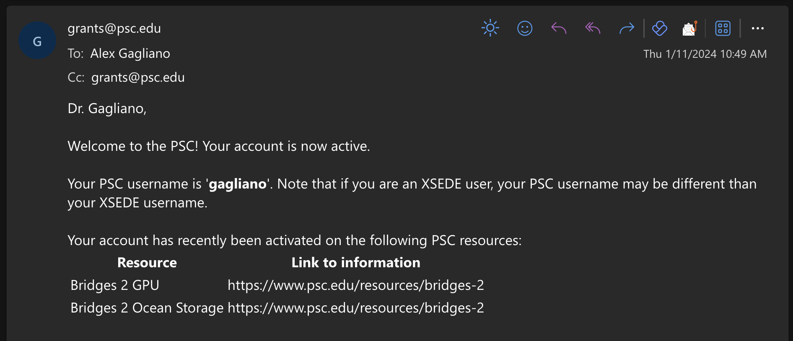
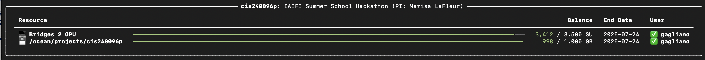
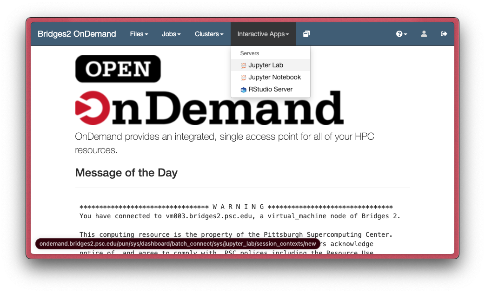
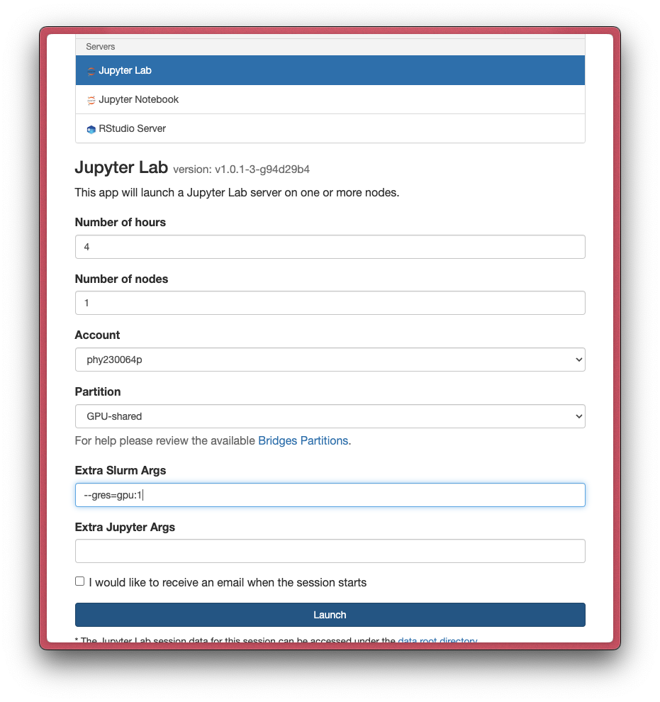

# HPC Guide for the 2024 IAIFI Summer School
## Alex Gagliano, gaglian2@mit.edu 

## Resources overview

- We have an ACCESS allocation of GPU resources on the Pittsburgh Supercomputing Center's Bridges-2 cluster through this week for tutorials and the Friday hacks.
- We have also reserved access to Nvidia V100 GPUs just for participants during the course of this week. We have 2 dedicated GPUs Tuesday-Thursday, and 6 GPUs Friday. We are happy to request more if needed (use them or we lose them!); please let us know if this is the case.

Basic workflows for using Bridges-2 are described below. For more info, see this [presentation](https://deeplearning.cs.cmu.edu/F22/document/recitation/Recitation10/Introduction%20to%20PSC.pdf) [PDF] or the comprehensive Bridges-2 User Guide: https://www.psc.edu/resources/bridges-2/user-guide/.

## Getting started

- If you registered for an ACCESS account and sent Marisa LaFleur your username, we've added you to the allocation. After this, it can take a few days for an account to be created on the Bridges-2 cluster. _Do not delay or you won't be able to use this compute for your Friday hack._ 

Once you've been added, you'll receive the following email:


- You will first need to set up a password by following the instructions towards the top of https://www.psc.edu/resources/bridges-2/user-guide/. TLDR: if this is a new account, go to [apr.psc.edu](https://apr.psc.edu/) and create a password.

> [!NOTE]  
> The PSC username is different from the ACCESS username! You will use your PSC username, not your ACCESS username, for Bridges-2 access.

- You can then access the cluster through the terminal by entering `ssh -Y [username]@bridges2.psc.edu`, which logs you into a login node.
- From the terminal, type `projects` to bring up info about quotas, storage directories etc.



- You can also easily login through your browser via OnDemand: https://ondemand.bridges2.psc.edu/.
	- Here, you can start e.g. a login terminal session (`Clusters > Bridge-2 Shell Access`) or launch a Jupyter Notebook/Lab job (`Interactive Apps > Jupyter...`)



> [!NOTE]  
> By default, OnDemand requests an entire GPU node (typically 8 GPUs). Do not request a full node if you don't need one! To request a single GPU (better use of resources), add `--gres=gpu:1` to the "Extra Slurm Args" field with a partition of `GPU-shared`.



## Launching jobs and GPU python environment

- The easiest way to get started is probably to launch a Jupyter Notebook/Lab job using OnDemand (see above).
- You can launch an interactive job using the `interact` command, and specifically a GPU job via `interact -gpu -t 01:00:00 --gres=gpu:v100-16:8 -N 1` (this launches a 1h GPU job, taking the full node and 8 GPUs with some sensible default configurations).
- You can check that you have access to GPU(s) via the `nvidia-smi` terminal command, which should pull up usage stats for available GPU(s).
- The easiest way to instantiate an AI-ready environment is to to load a predefined set of modules (see available ones via `module spider AI`).
	- E.g., `module load AI/pytorch_23.02-1.13.1-py3` will work for common use-cases.
	- You can install additional modules as needed via e.g. `pip install astropy`, which will install to local user directories. 

## Storage

Here are the relevant directories for this week (with username replaced where necessary):
```
   Directories:
       HOME /jet/home/gagliano
       STORAGE /ocean/projects/cis240096p
       STORAGE /ocean/projects/cis240096p/shared
       STORAGE /ocean/projects/cis240096p/gagliano
```
In particular, shared datasets and code will be in `/ocean/projects/cis240096p/shared`. We will be (slowly) adding the tutorial materials to this shared space.

## Launching batch jobs

Jobs can be submitted using the SLURM scheduler. Here is a minimal example script (`gpu_job.sh`) that requests 1 GPU and 8h of runtime for the program `gpu_program.py` (replace this with your own script). You can submit it via `sbatch gpu_job.sh`.

``` bash
#!/bin/bash

#SBATCH --job-name=train
#SBATCH --nodes=1
#SBATCH -p GPU
#SBATCH -t 8:00:00
#SBATCH --gpus=v100-32:1  # Request 1 GPU. --gres=gpu:1 is also fine.

set -x  # Echo commands to stdout

cd /ocean/projects/phy230064p/username

# Run code
python gpu_program.py
```

`squeue [-u username]` will show you the status of your jobs, and `scancel [jobid]` will cancel a job. For more options, see https://www.psc.edu/resources/bridges-2/user-guide/. 

> [!NOTE]
> To skip the queues and jump to our dedicated GPUs, add `--reservation=Tutorialcis240096p` Tues-Thurs and `--reservation=GPUcis240096p` Friday to the 'Extra Slurm Args' in OnDemand and for regular jobs in a batch script or at the command line.

Any questions, don't hesitate to reach out via email (gaglian2@mit.edu) or on the Summer School slack.

_Notes copied heavily from Siddharth Mishra-Sharma_
